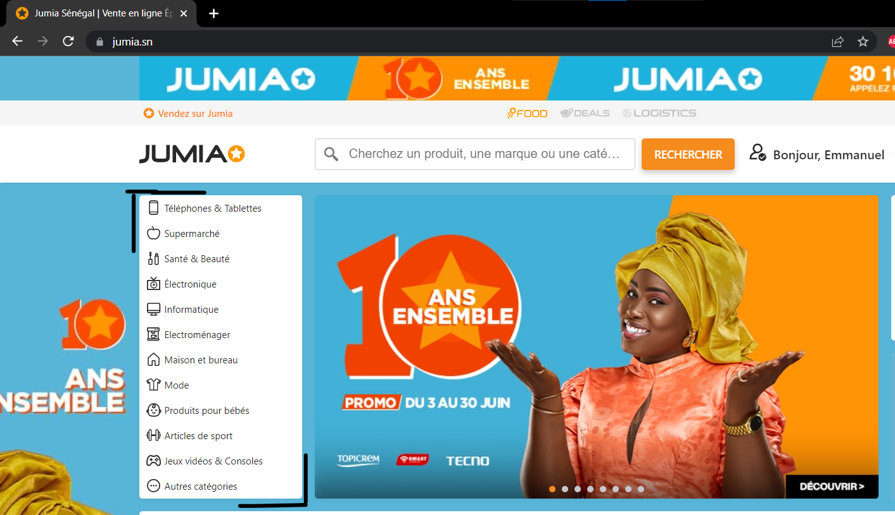

# Overview

Here is a repository to share my web scraping of [Jumia Senegal](www.jumia.sn) that I started on June 5th, 2022.

# Jumia

Jumia is a Pan-African technology company that is built around a marketplace, logistics service and payment service. The logistics service enables the delivery of packages through a network of local partners while the payment services facilitate the payments of online transactions within Jumia’s ecosystem.

# Web Scraping
## Categories
I started to scrape the articles on the website focusing on main categories that are in the menu. `notebook: Jumia_SN.ipynb`

For the first category `Téléphones & Tablettes`, have a loook bellow. 

A sample of scraped data is bellow.

# Usage
## Initialization
In the parent folder (=> `selenium` ), open `initialization.ipynb` notebook and execute all the cells to initialize selenium.

## Scrape
Open `Jumia_SN.ipynb` notebook ( or other notebooks that scrape information diffrently) and execute all the cells to scrape all the articles of all categories. The CSV files in the folder `data` will be updated.

# Reach me out

Do not hesitate to do ask questions about the techniques and approaches I apply to scrape a website. 

Do not hesitate to do any request if you want to hire me for a to scrape a website. 

# Author
Emmanuel KOUPOH : emmanuelkoupoh@gmail.com