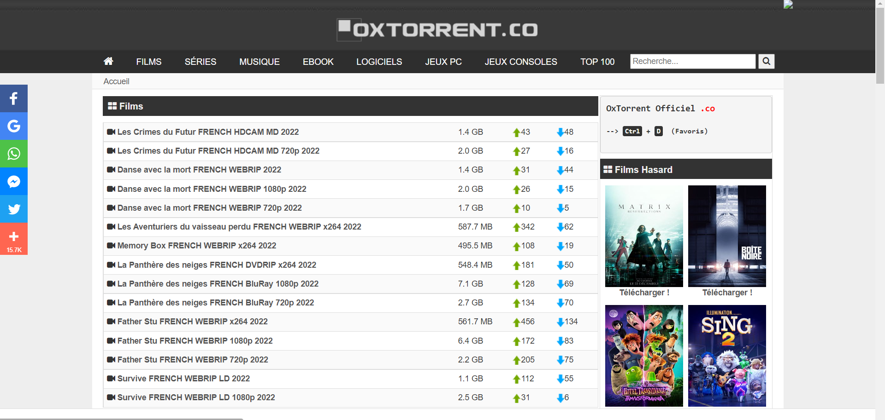
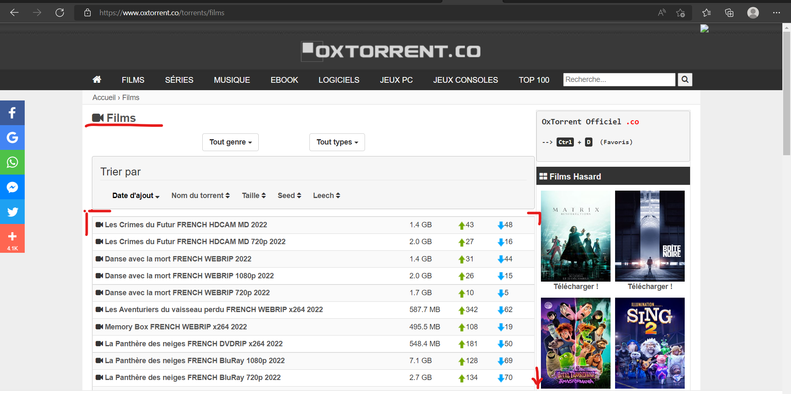
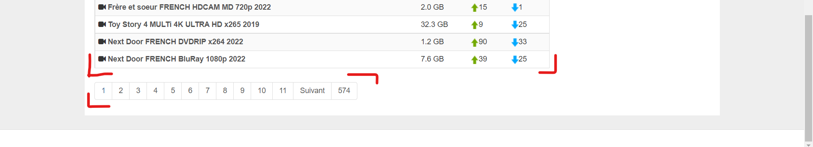

# Overview

Here is a repository to share my web scraping of [OxTorrent](www.oxtorrent.co) that I started on June 6th, 2022.

# OxTorrent

OxTorrent is a P2P torrent platform.

# Web Scraping
## Get header/main categories
I started to scrape  by getting the header to identify all the main categories. 

## Explore header items/categories 
Once I got categories, I explored to collect torrent infomation that are stored as a table.

At the bottom of a page of a category, there is the pagination system that can be use to move through the category.

## Save scaped data
After all, the collected data are saved in tables in the `data` folder as follow:

# Usage
## Initialization
In the parent folder (=> `selenium` ), open `initialization.ipynb` notebook and execute all the cells to initialize selenium.

## Scrape
Open `Oxtorrent.co.ipynb` notebook and execute all the cells to scrape all the torrents of all categories. The CSV files in the folder `data` will be updated.

# Reach me out

Do not hesitate to do ask questions about the techniques and approaches I apply to scrape a website. 

Do not hesitate to do any request if you want to hire me for a to scrape a website. 

# Author
Emmanuel KOUPOH : emmanuelkoupoh@gmail.com